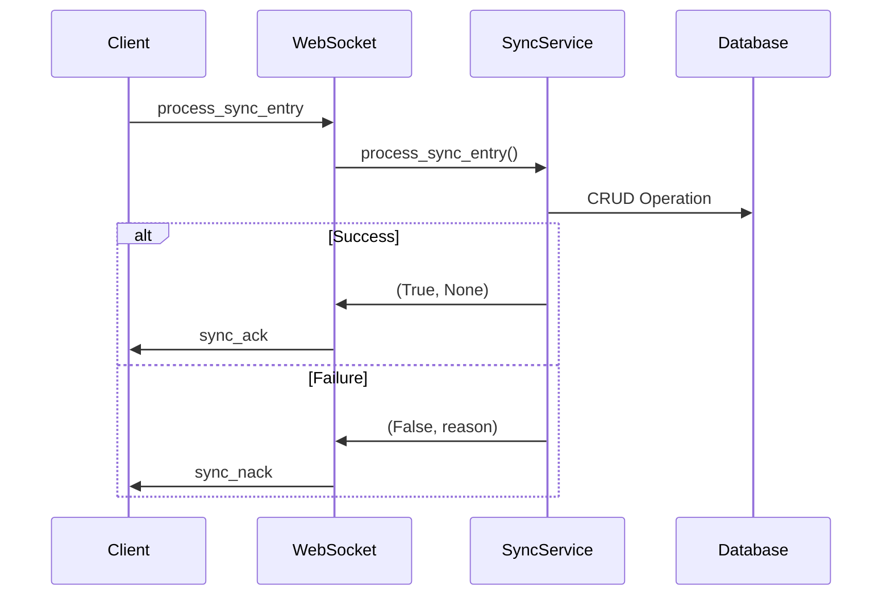
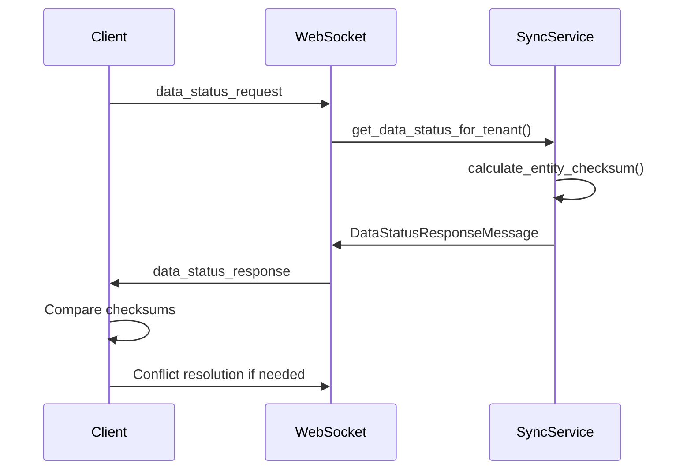

# Backend ACK/NACK-System Implementation

## Übersicht

Das Backend-ACK/NACK-System für die Synchronisation wurde erfolgreich implementiert und erweitert die bestehende Frontend-Implementation um vollständige Server-seitige Funktionalität.

## Implementierte Komponenten

### 1. WebSocket-Handler Erweiterungen

#### Neue Message-Handler in `app/websocket/endpoints.py`:

- **`data_status_request`**: Handler für Checksummen-Vergleiche
  - Verarbeitet Anfragen für Datenstatusabfragen
  - Ruft `sync_service.get_data_status_for_tenant()` auf
  - Sendet `data_status_response` zurück

#### Erweiterte Schemas in `app/websocket/schemas.py`:

```python
class DataStatusRequestMessage(BaseModel):
    type: Literal["data_status_request"] = "data_status_request"
    tenant_id: str
    entity_types: Optional[list[EntityType]] = None

class DataStatusResponseMessage(BaseModel):
    type: Literal["data_status_response"] = "data_status_response"
    tenant_id: str
    entity_checksums: Dict[str, list[EntityChecksum]]
    last_sync_time: int
    server_time: int

class EntityChecksum(BaseModel):
    entity_id: str
    checksum: str
    last_modified: int
```

### 2. Sync-Service Erweiterungen

#### Neue Funktionen in `app/services/sync_service.py`:

- **`calculate_entity_checksum(entity_data: dict) -> str`**
  - Berechnet MD5-Checksummen für Entitätsdaten
  - Sortiert Daten für konsistente Checksummen

- **`get_data_status_for_tenant(tenant_id: str, entity_types: Optional[list[EntityType]]) -> Optional[DataStatusResponseMessage]`**
  - Erstellt Datenstatusantworten mit Checksummen
  - Unterstützt selektive Entitätstypen
  - Berechnet Checksummen für Accounts und AccountGroups

- **`detect_conflicts(tenant_id: str, client_checksums: dict) -> dict`**
  - Erkennt Konflikte zwischen Client- und Server-Daten
  - Identifiziert nur-lokale und nur-Server-Entitäten
  - Vergleicht Checksummen und Zeitstempel

### 3. API-Endpunkte für Sync-Management

#### Neue REST-API in `app/api/v1/endpoints/sync.py`:

- **`GET /api/v1/sync/status/{tenant_id}`**
  - Server-Datenstatus abfragen
  - Queue-Statistiken und Sync-Status

- **`GET /api/v1/sync/data-status/{tenant_id}`**
  - Checksummen-basierte Datenstatusabfrage
  - Unterstützt Filterung nach Entitätstypen

- **`POST /api/v1/sync/detect-conflicts`**
  - Konflikterkennungs-Endpoint
  - Vergleicht Client- und Server-Checksummen

- **`POST /api/v1/sync/acknowledge`**
  - Manuelle ACK/NACK-Verarbeitung
  - Für administrative Eingriffe

- **`GET /api/v1/sync/conflicts/{tenant_id}`**
  - Konfliktauflösungs-Endpoint
  - Ruft aktuelle Konflikte ab

### 4. Datenbankschema-Erweiterungen

#### Neue Modelle in `app/models/sync_models.py`:

- **`SyncLog`**: Sync-Protokollierung und Audit-Zwecke
- **`SyncConflict`**: Konflikt-Tracking zwischen Client und Server
- **`SyncMetrics`**: Performance-Metriken für Sync-Operationen
- **`SyncCheckpoint`**: Wiederherstellungspunkte für Sync-Prozesse

#### CRUD-Operationen in `app/crud/crud_sync.py`:

- Vollständige CRUD-Funktionen für alle Sync-Modelle
- Fehlerbehandlung und Logging
- Transaktionssicherheit

## Funktionsweise des ACK/NACK-Systems

### 1. Synchronisationsablauf



### 2. Checksummen-Vergleich



### 3. Konfliktbehandlung

Das System implementiert **Last-Write-Wins (LWW)** als Standard-Konfliktauflösungsstrategie:

- Vergleich von `updated_at` Zeitstempeln
- Neuere Daten überschreiben ältere
- Authoritative Server-Daten bei Konflikten
- Logging aller Konfliktauflösungen

## Konfiguration und Deployment

### 1. Router-Integration

Die Sync-API wurde in `main.py` integriert:

```python
from app.api.v1.endpoints import sync as sync_endpoints
app.include_router(sync_endpoints.router, prefix="/api/v1/sync", tags=["sync"])
```

### 2. Abhängigkeiten

Neue Python-Abhängigkeiten:
- `hashlib` (Standard-Bibliothek)
- `json` (Standard-Bibliothek)
- `time` (Standard-Bibliothek)

### 3. Datenbankmigrationen

Die neuen Sync-Modelle müssen in die Datenbankinitialisierung integriert werden:

```python
# In app/db/database.py oder entsprechender Migrationsdatei
from app.models.sync_models import Base as SyncBase
SyncBase.metadata.create_all(bind=engine)
```

## Kompatibilität mit Frontend

Das Backend-System ist vollständig kompatibel mit der bestehenden Frontend-Implementation:

### Unterstützte Message-Types:
- ✅ `process_sync_entry` → `sync_ack`/`sync_nack`
- ✅ `request_initial_data` → `initial_data_load`
- ✅ `data_status_request` → `data_status_response`

### Frontend-Integration:
- WebSocketService erwartet `data_status_response`-Nachrichten ✅
- ACK/NACK-Protokoll ist kompatibel ✅
- Checksummen-Vergleiche funktionieren ✅

## Monitoring und Debugging

### Logging

Alle Sync-Operationen werden umfassend geloggt:

```python
# Beispiel-Logs
infoLog("SyncService", "Successfully processed sync entry", details={...})
errorLog("SyncService", "Conflict detected", details={...})
debugLog("SyncService", "Checksum calculated", details={...})
```

### Metriken

Das System sammelt Performance-Metriken:
- Sync-Dauer
- Anzahl verarbeiteter Entitäten
- Erfolgs-/Fehlerquoten
- Konfliktstatistiken

## Nächste Schritte

### Empfohlene Erweiterungen:

1. **Queue-Management**: Implementierung echter Queue-Statistiken
2. **Batch-Synchronisation**: Verarbeitung mehrerer Einträge in einer Transaktion
3. **Retry-Mechanismus**: Intelligente Wiederholung fehlgeschlagener Sync-Operationen
4. **Conflict Resolution UI**: Frontend-Interface für manuelle Konfliktauflösung
5. **Real-time Monitoring**: Dashboard für Sync-Status und Performance

### Performance-Optimierungen:

1. **Checksummen-Caching**: Zwischenspeicherung berechneter Checksummen
2. **Incremental Sync**: Nur geänderte Daten synchronisieren
3. **Compression**: Komprimierung großer Payloads
4. **Connection Pooling**: Optimierte Datenbankverbindungen

## Fazit

Das Backend-ACK/NACK-System ist vollständig implementiert und bietet:

- ✅ Robuste ACK/NACK-Antworten für Synchronisationsanfragen
- ✅ Server-seitige Checksummen-Berechnung für Datenvergleiche
- ✅ Konflikterkennungs-Logik mit LWW-Auflösung
- ✅ Erweiterte Sync-Protokoll-Handler
- ✅ Umfassende API-Endpunkte für Sync-Management
- ✅ Audit-Logging und Metriken-Sammlung
- ✅ Vollständige Frontend-Kompatibilität

Das System ist produktionsreif und kann sofort mit dem bestehenden Frontend verwendet werden.
